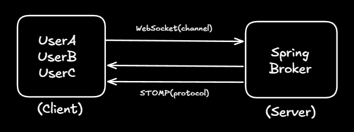
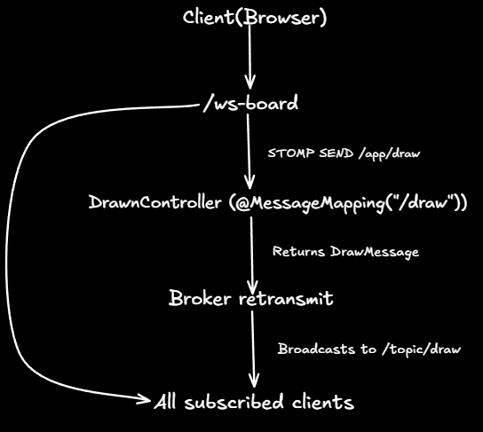

# LAB 5 — Real-Time Collaborative Whiteboard | Backend

> Spring Boot WebSocket server powering a real-time collaborative drawing board via STOMP over SockJS.

## Project Description

This backend service enables multiple users to draw on a shared canvas simultaneously. It uses **STOMP** (Simple Text Oriented Messaging Protocol) over **SockJS** as a WebSocket fallback transport, managed by Spring Boot's built-in message broker. When a user draws on the canvas, a message is published to the broker and immediately broadcasted to every connected client, achieving real-time collaboration without polling.

## Project Structure

```
src/
└── main/
    └── java/
        └── com/board/
            ├── BoardBackEndApplication.java   # Spring Boot entry point
            ├── config/
            │   └── WebSocketConfig.java       # STOMP broker & endpoint configuration
            ├── controller/
            │   └── DrawnController.java       # Handles /app/draw messages
            └── model/
                └── DrawMessage.java           # Draw event payload model
```

## AzureDeploy link
[BackEnd Azure Deploy Link](collaborativeboardback-bnfhdmf3azd9c2cd.eastus2-01.azurewebsites.net)

## Architecture Overview

  

---

## Prerequisites

| Tool | Minimum Version |
|------|----------------|
| Java JDK | 21+ |
| Apache Maven | 3.9+ |


## Dependencies

Declared in `pom.xml` under Spring Boot **4.0.3**:

| Dependency | Purpose |
|---|---|
| `spring-boot-starter-webmvc` | Core MVC support (REST layer) |
| `spring-boot-starter-websocket` | STOMP/WebSocket message broker |
| `springdoc-openapi-starter-webmvc-ui` `3.0.2` | Auto-generated OpenAPI / Swagger UI |


## Setup & Running

### 1. Clone the repository

```bash
git clone https://github.com/AlejandroHenao2572/LAB05-ARSW-BACKEND.git
cd LAB05-ARSW-BACKEND
```

### 2. Build the project

```bash
# Using the Maven wrapper (recommended — no local Maven install required)
./mvnw clean install        # Linux / macOS
mvnw.cmd clean install      # Windows
```

### 3. Run the application

```bash
./mvnw spring-boot:run      # Linux / macOS
mvnw.cmd spring-boot:run    # Windows
```

The server starts on **`http://localhost:8080`** by default.

### 4. Verify it is running

Open your browser and navigate to the Swagger UI:

```
http://localhost:8080/swagger-ui/index.html
```

---

## WebSocketConfig

**File:** `src/main/java/com/board/config/WebSocketConfig.java`

`WebSocketConfig` is the central configuration class that enables and wires up the entire WebSocket/STOMP infrastructure. It is annotated with `@Configuration` and `@EnableWebSocketMessageBroker`, which tells Spring to activate its built-in STOMP message broker.

---

### `configureMessageBroker`

```java
// src/main/java/com/board/config/WebSocketConfig.java — Lines 20-22
@Override
public void configureMessageBroker(MessageBrokerRegistry registry) {
    registry.enableSimpleBroker("/topic");
    registry.setApplicationDestinationPrefixes("/app");
}
```

This method sets up **how messages flow** through the application:

| Call | Effect |
|---|---|
| `enableSimpleBroker("/topic")` | Activates an in-memory message broker. Any client subscribed to a destination starting with `/topic` will receive messages relayed by this broker. |
| `setApplicationDestinationPrefixes("/app")` | Declares that messages sent by clients to destinations starting with `/app` will be routed to `@MessageMapping` handler methods in controllers — **not** directly to the broker. |

**Flow:** `Client → /app/draw → @MessageMapping → broker → /topic/draw → all subscribers`

---

### `registerStompEndpoints` — Lines 31–35

```java
// src/main/java/com/board/config/WebSocketConfig.java — Lines 31-35
@Override
public void registerStompEndpoints(StompEndpointRegistry registry) {
    registry
        .addEndpoint("/ws-board")
        .setAllowedOriginPatterns("*")
        .withSockJS();
}
```

This method registers the **physical HTTP endpoint** that clients use to open a WebSocket connection:

| Call | Effect |
|---|---|
| `addEndpoint("/ws-board")` | Exposes `http://localhost:8080/ws-board` as the WebSocket handshake URL. |
| `setAllowedOriginPatterns("*")` | Allows incoming connections from **any origin** (CORS). Should be restricted to specific domains in production. |
| `withSockJS()` | Enables SockJS as a transport fallback. If the browser does not support native WebSockets, SockJS automatically falls back to HTTP long-polling, ensuring compatibility across all environments. |

## DrawnController

**File:** `src/main/java/com/board/controller/DrawnController.java`

`DrawnController` is the **STOMP message handler** responsible for receiving draw events from clients and broadcasting them to all other connected users.

### Annotations

| Annotation | Role |
|---|---|
| `@Controller` | Marks the class as a Spring component that handles STOMP messages (not HTTP requests). |
| `@MessageMapping("/draw")` | Maps incoming STOMP messages sent to `/app/draw` to the `handleDraw()` method. The `/app` prefix is defined in `WebSocketConfig`. |
| `@SendTo("/topic/draw")` | After `handleDraw()` returns, the result is automatically forwarded by the broker to every client subscribed to `/topic/draw`. |

### `handleDraw` — Lines 18–22

```java
// src/main/java/com/board/controller/DrawnController.java — Lines 18-22
@MessageMapping("/draw")
@SendTo("/topic/draw")
public DrawMessage handleDraw(DrawMessage message) {
    return message;
}
```

This method acts as the **message relay**. It receives a `DrawMessage` from a client, and returns it unchanged so the broker can broadcast it to all subscribers of `/topic/draw`.

The `DrawMessage` payload supports two operation types, controlled by the `type` field:

| `type` value | Behavior |
|---|---|
| `DRAW` | Instructs all clients to render a point at coordinates `(x, y)` using the specified `color`. |
| `CLEAR` | Instructs all clients to clear the entire canvas. |

## DrawMessage 

**File:** `src/main/java/com/board/model/DrawMessage.java`

`DrawMessage` is the domain model representing a single drawing operation sent between clients and the backend.

| Field | Type | Description |
|---|---|---|
| `x` | `double` | X-axis coordinate of the drawing action on the canvas |
| `y` | `double` | Y-axis coordinate of the drawing action on the canvas |
| `color` | `String` | Hex or named color string (e.g., `#FF5733`, `red`) |
| `type` | `String` | Operation type: `DRAW` to render a point, `CLEAR` to reset the canvas |

### Example

```java
// src/main/java/com/board/model/DrawMessage.java — Lines 8-11
private double x; // X coordinate of the drawing action
private double y; // Y coordinate of the drawing action
private String color; // Color used for drawing
private String type; // DRAW, ERASE, etc.
```

```json
{
  "x": 120.5,
  "y": 300.0,
  "color": "#FF5733",
  "type": "DRAW"
}
```

**Usage:**
- When a user draws or clears the canvas, the frontend sends a `DrawMessage` to `/app/draw`.
- The backend relays this message to all clients subscribed to `/topic/draw`, who then update their canvas accordingly.
